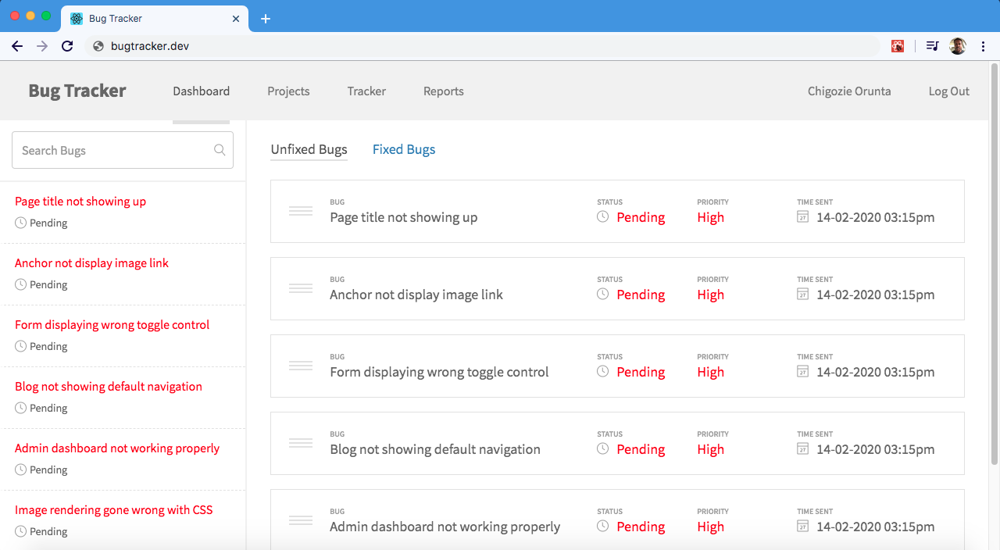

# bug-tracker

A React application built to help developers & teams manage bugs and resolve issues for ongoing projects.

## Usage

Useful for individual or teams of developers who want to manage bugs and fixtures for various types of issues. Simple, clean and easy to use.

