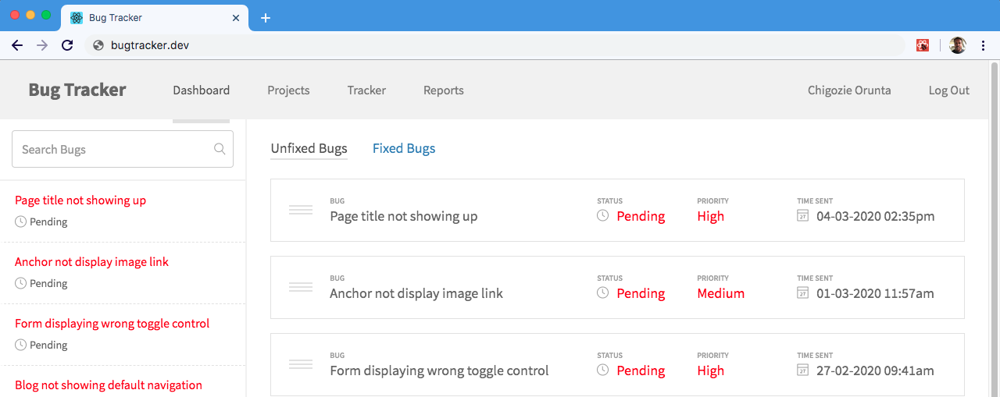

# bug-tracker

A React application built to help developers & teams manage bugs and resolve issues for ongoing application projects.

## Usage

Useful for individual or teams of developers who want to manage bugs and fixtures for various types of issues. Simple, clean and easy to use.

## Projects & Teams

Every bug is assigned to a project by default. Ultimately a project can have several bugs and fixtures assigned to it. Once a project is created, you can select any number of team members via email to join the project and track bugs quickly on the go.
